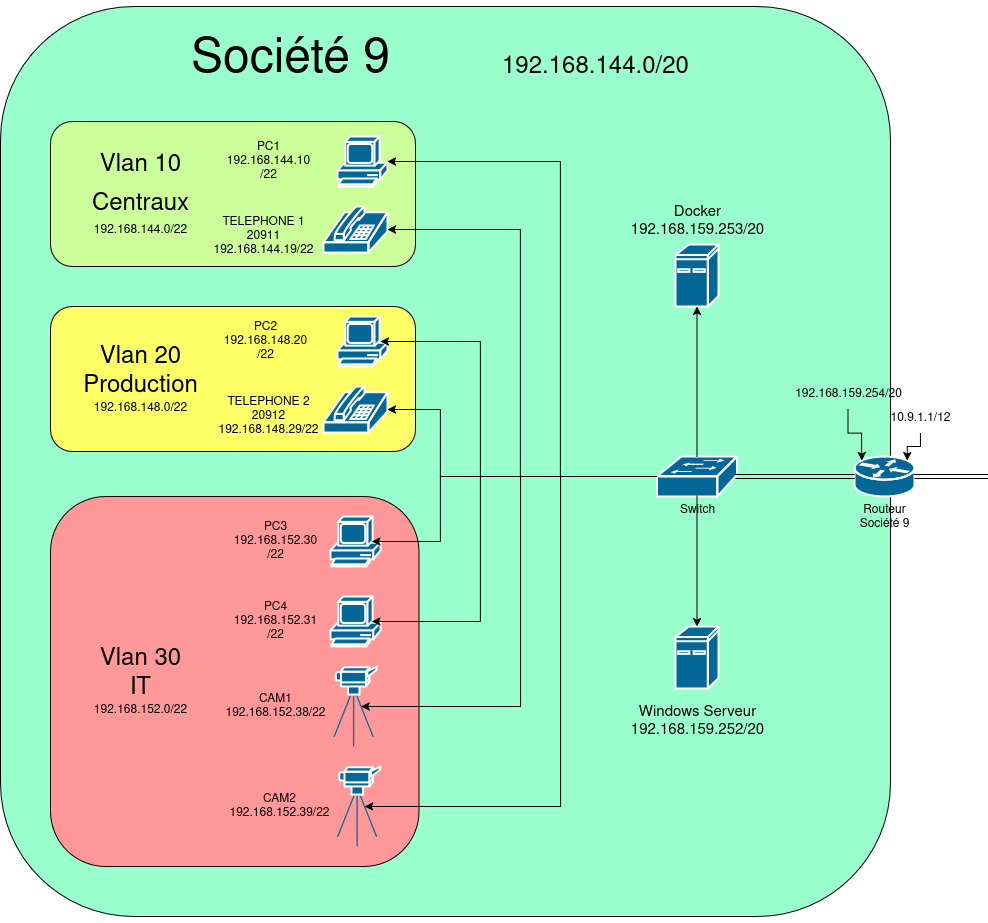
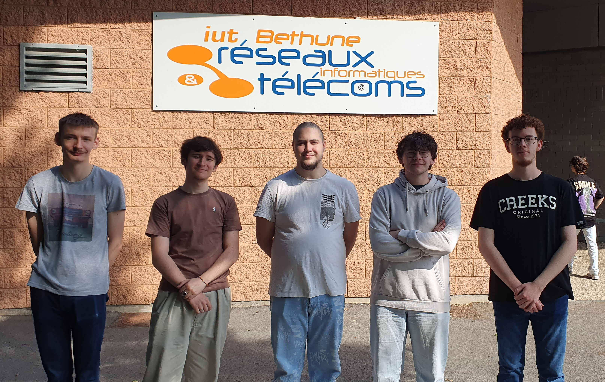

# Présentation Pépinière

# 🌱 Projet Pépinière - SAE21 / SAE24

## 🧭 Plan d'adressage

  

## 🎯 Objectifs

Ce projet a pour but de concevoir, configurer et sécuriser l'infrastructure réseau complète d'une entreprise fictive intégrée dans une pépinière d'entreprises. Ce travail s'effectue en équipe, dans un contexte professionnel simulé, avec une attention particulière sur la configuration système, réseau, téléphonie IP, sécurité, services web et objets connectés.

## 📌 Consignes principales

- Construire un **plan d'infrastructure réseau** logique et évolutif
- Configurer les **équipements réseau** (switchs, routeurs)
- Déployer des **services sous Docker** (Web, TFTP, BDD…)
- Assurer la **téléphonie IP** et prioriser ce trafic
- Mettre en place une **vidéosurveillance via caméras IP**
- Intégrer un **capteur de température** via LoRa
- Implémenter un **intranet** affichant données capteur et flux vidéo
- Développer un script de **reconnaissance de badge via OpenCV**
- Créer un script d’**écoute de communication téléphonique** à partir de captures réseau
- Assurer la **sécurité** des données et des flux réseau

## 👥 Organisation du travail

- Travail **individuel** (Jour 1) : plan personnel, préférences de tâches
- Travail **collectif** : fusion des idées, création de la matrice RACI et du Gantt prévisionnel
- Réalisation technique : sur **6 jours**, en équipe
- Rendu final : **rapport**, **archive de configuration**, **soutenance orale**

## 🛠 Technologies et matériels utilisés

- **Cisco** (Switchs, Routeurs)
- **Docker**, **Linux**, **Windows**, **MacOS**
- **Arduino + LoRa Shield**
- **Téléphones IP** : Fanvil, Cisco
- **Caméras IP** : Vivotek
- **OpenCV**, **Python**

## 📁 Structure du dépôt

- `docs/` : Documentation utilisée et générée
- `configs/` : Fichiers de configuration réseau, docker, système…
- `scripts/` : Scripts pour caméra IP, LoRa, reconnaissance badge, etc.
- `gantt/` : Diagramme de Gantt
- `raci/` : Matrice RACI
- `journal_de_bord.md` : Suivi des tâches par membre
- `rapport_final.md` : Rapport de synthèse

## 🧑‍🏫 Évaluation

Le projet est évalué à la fois collectivement et individuellement :

| SAE | Poids | Éléments |
| --- | --- | --- |
| SAE21 | 50% | Infra réseau + config système |
| SAE24 | 50% | Services + développement + soutenance |

## 🌐 Liens utiles

- [Wiki RACI](https://fr.wikipedia.org/wiki/RACI)
- [Portail projet](http://www.pepiniere.rt/)

---

## 🥇 L'équipe

> Projet encadré par le département R&T de l'IUT de Béthune
> 
> 
> Toute l’équipe est mobilisée pour atteindre les objectifs avec rigueur, autonomie et entraide !
> 

Société 9, RAMBA !

<aside>

Mathéo Crépieux 

Alan Gaubert

Benjamin Petillon 

Alexis Stingre

Raphaël Laurent

</aside>

  

